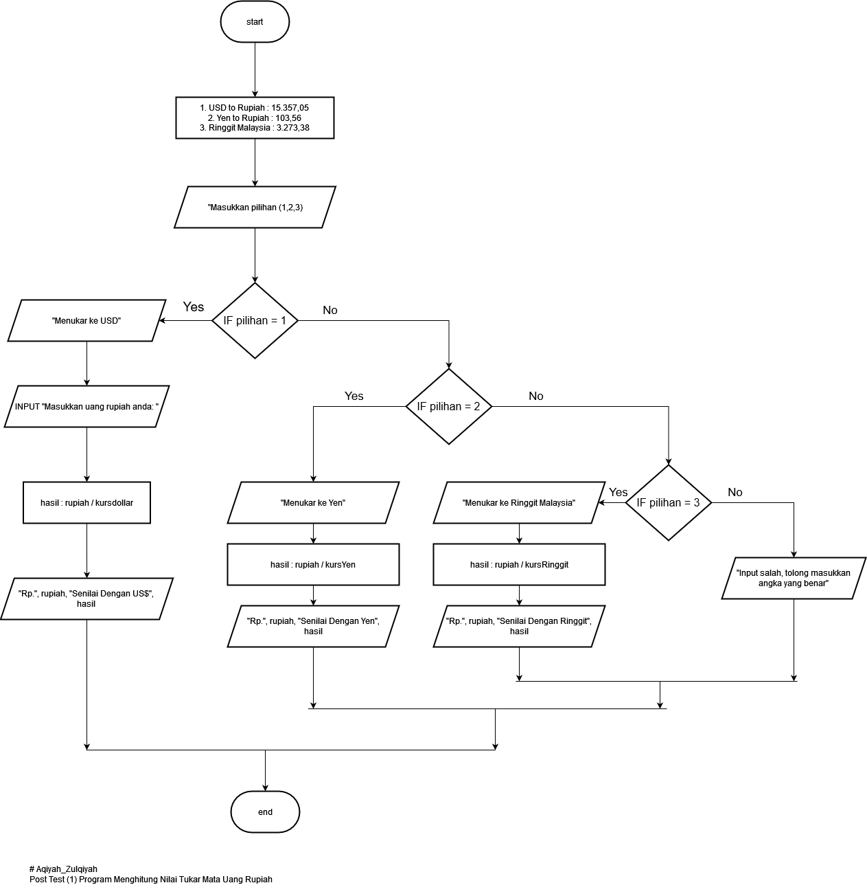
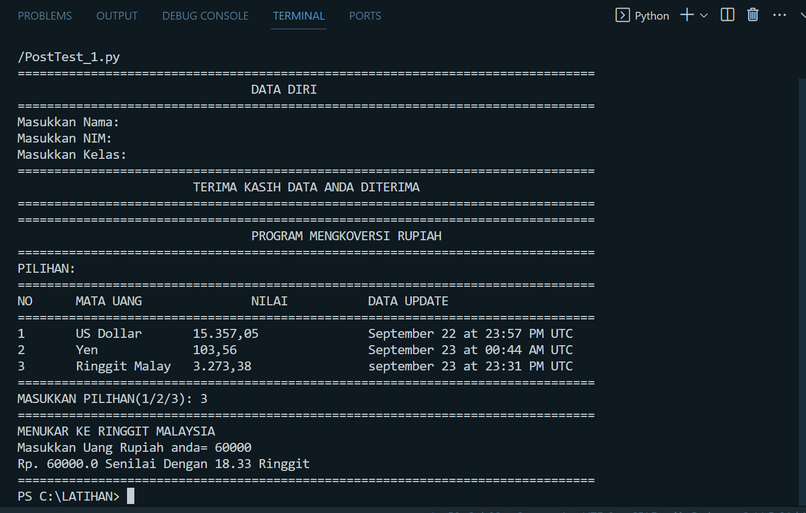
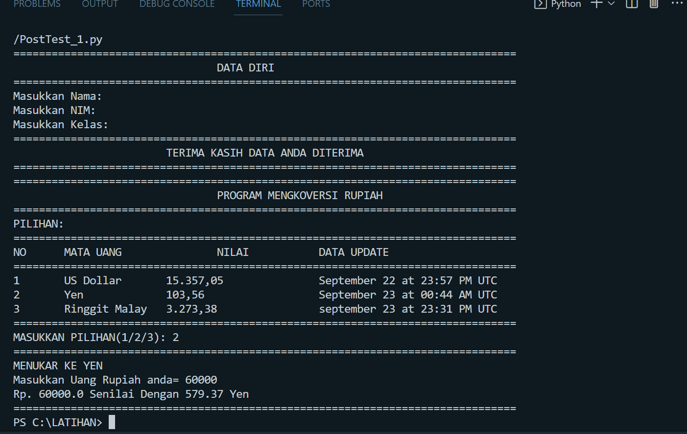
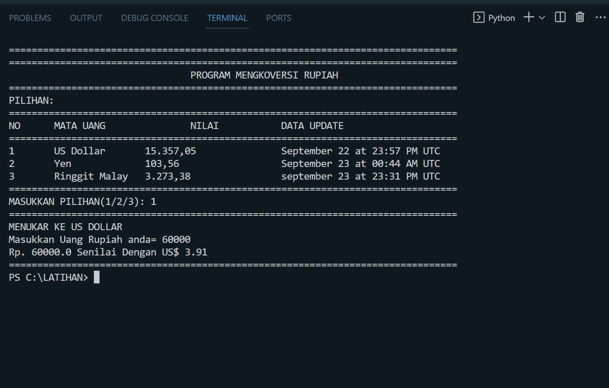

## Program Konversi Mata Uang

Ini adalah program sederhana yang mengkonversi mata uang Rupiah ke mata uang asing (USD, Yen dan Ringgit Malaysia)

### Cara Penggunaan

1. Masukkan pilihan anda ingin mengkonversi rupiah ke mata uang asing apa
2. Masukkan jumlah uang Rupiah anda
2. Program akan menghitung jumlah yang setara dalam Rupiah berdasarkan nilai tukar yang ditentukan.

### Flowchart/Diagram Alir

### Output

Menampilkan hasil bagi dari rupiah dengan kurs mata uang asing (seperti pada gambar SS Ringgit, Yen, USD).
### Output Rupiah ke  Ringgit.

### Output Rupiah ke  Yen

### Output Rupiah ke  USD

Jika terjadi kesalahan dalam penginputan nomor pilihan dari angka yg disediakan. Akan menampilkan "Input salah, tolong masukkan angka yang benar"

