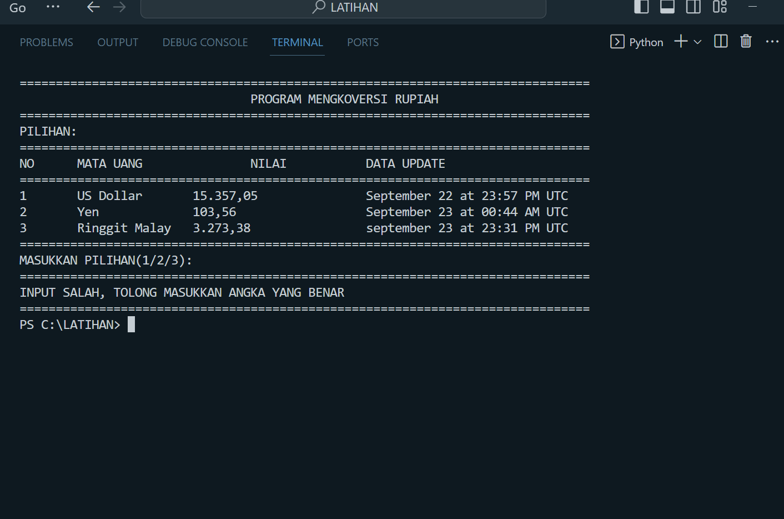

## Program Konversi Mata Uang

Ini adalah program sederhana yang mengkonversi mata uang Rupiah ke mata uang asing (USD, Yen dan Ringgit Malaysia)

### Cara Penggunaan

1. Masukkan pilihan anda ingin mengkonversi rupiah ke mata uang asing apa
2. Masukkan jumlah uang Rupiah anda
2. Program akan menghitung jumlah yang setara dalam Rupiah berdasarkan nilai tukar yang ditentukan.

### Kode Program

print("="*79)
print("\t\t\t\tDATA DIRI\t\t\t\t")
print("="*79)
nama = input("Masukkan Nama: ")
nim = input("Masukkan NIM: ")
alamat = input("Masukkan Kelas: ")
print("="*79)
print("\t\t\tTERIMA KASIH DATA ANDA DITERIMA\t\t\t\t")
print("="*79)

print("="*79)
print("\t\t\t\tPROGRAM MENGKOVERSI RUPIAH\t\t\t\t")
print("="*79)

# NILAI TUKAR/KURS MATA UANG ASING
print("PILIHAN: ")
print("="*79)
print("NO\tMATA UANG\t\tNILAI\t\tDATA UPDATE")
print("="*79)
print("1\tUS Dollar\t15.357,05\t\tSeptember 22 at 23:57 PM UTC")
print("2\tYen\t\t103,56\t\t\tSeptember 23 at 00:44 AM UTC")
print("3\tRinggit Malay\t3.273,38\t\tseptember 23 at 23:31 PM UTC")

# MASUKKAN PILIHAN INGIN MENGKOVERSI RUPIAH KE MATA UANG APA
print("="*79)
pilih = input("MASUKKAN PILIHAN(1/2/3): ")
print("="*79)

# PILIHAN 1 MENUKAR RUPIAH KE USD
if pilih == '1':
    print("MENUKAR KE US DOLLAR")
    kursDolar = 15357.05
    rupiah = float(input("Masukkan Uang Rupiah anda= "))
    # MENGHITUNG JUMLAH RUPIAH SETARA DENGAN USD
    rupToDol = rupiah / kursDolar
    dolDecimal = round(rupToDol, 2)
    print("Rp.",rupiah,"Senilai Dengan US$", dolDecimal)

# PILIHAN 2 MENUKAR RUPIAH KE YEN
elif pilih == '2':
    print("MENUKAR KE YEN")
    kursYen = 103.56
    rupiah = float(input("Masukkan Uang Rupiah anda= "))
    # MENGHITUNG JUMLAH RUPIAH SETARA DENGAN YEN
    rupToYen = rupiah / kursYen
    yenDecimal = round(rupToYen, 2)
    print("Rp.",rupiah,"Senilai Dengan", yenDecimal, "Yen")

# PILIHAN 3 MENUKAR RUPIAH KE RINGGIT
elif pilih == '3':
    print("MENUKAR KE RINGGIT MALAYSIA")
    kursRinggit = 3273.38
    rupiah = float(input("Masukkan Uang Rupiah anda= "))
    # MENGHITUNG JUMLAH RUPIAH SETARA DENGAN RINGGIT
    rupToRinggit = rupiah / kursRinggit
    ringgitDecimal = round(rupToRinggit, 2)
    print("Rp.",rupiah,"Senilai Dengan", ringgitDecimal, "Ringgit")

# JIKA MEMASUKKAN ANGKA SELAIN 1,2,3 AKAN MENAMPILKAN INPUT SALAH
else:
    print("Input salah, tolong masukkan angka yang benar")
print("="*79)

### Output

Menampilkan hasil bagi dari rupiah dengan kurs mata uang asing (seperti pada gambar SS Ringgit, Yen, USD).
# Output Rupiah ke  Ringgit

# Output Rupiah ke  Yen

# Output Rupiah ke  USD

Jika terjadi kesalahan dalam penginputan nomor pilihan dari angka yg disediakan. Akan menampilkan "Input salah, tolong masukkan angka yang benar"

